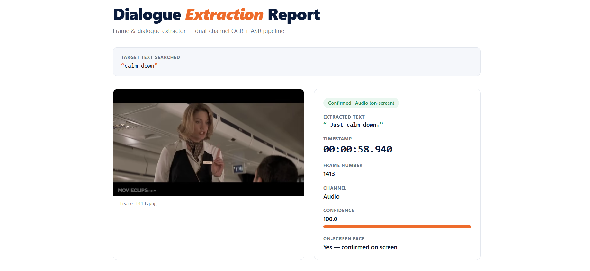

# Frame & Dialogue Extractor

Given a video URL and a target dialogue string, finds the exact frame where that dialogue *first* appears, extracts the text, and saves the frame.

Design rationale, the search strategy, and how ambiguous results are handled are documented in **[APPROACH.md](APPROACH.md)**. This file is install-and-run instructions only.

## ⚠️ If a video URL fails to download, read this first

Any video source can be temporarily unreachable from a given network, this isn't specific to any one site. `--url https://ok.ru/video/...` is the reference example that motivated this section (blocked at the network/TLS level on some ISPs during development, connection reset mid-TLS-handshake, reproducible with plain `curl`, unrelated to this code), but the same handling applies to any URL.

The pipeline retries transient failures automatically (a few attempts with backoff) before giving up, and also verifies a completed download's actual duration against what the source reported: yt-dlp can report "success" while having silently skipped fragments, so a mismatch is caught and retried rather than trusted. If it still can't get a usable file, it fails with a clear message telling you which of these happened, instead of a stack trace:

- **"This doesn't look like a usable video source"**: not a local file, not a URL, or the URL has no video at it.
- **"Missing dependency"**: a required package isn't importable, most commonly caused by running a system-wide `python` instead of this project's venv interpreter (see Install below).
- **"Could not reach the video source after retrying"**: the network genuinely can't reach the host.
- **"Could not obtain a usable video file"**: downloaded, but failed the completeness check even after retries.

**Workaround for any of these:** download the video by any means available to you (browser, another network, etc.) and pass the local file instead:

```bash
python cli.py --url "C:\path\to\downloaded_video.mp4" --text "My mind rebels at stagnation"
```

`--url` accepts a local file path, a direct media URL, or any [yt-dlp-supported](https://github.com/yt-dlp/yt-dlp/blob/master/supportedsites.md) site URL (YouTube, Vimeo, Dailymotion, VK, ok.ru, ~1800 others) interchangeably, the pipeline auto-detects which kind it was given, and always accepts a local file as a fallback regardless of what went wrong with the URL.

## Install

Requires Python 3.10+.

```bash
python -m venv .venv
# Windows:
.venv\Scripts\activate
# macOS/Linux:
source .venv/bin/activate

python -m pip install --upgrade pip

# Install CPU-only torch FIRST, otherwise pip may resolve a multi-GB CUDA
# build via EasyOCR's dependency chain that you almost certainly don't need.
pip install torch torchvision --index-url https://download.pytorch.org/whl/cpu

pip install -r requirements.txt
```

No system binaries required: `ffmpeg` is bundled via `imageio-ffmpeg`, video decoding via `opencv-python-headless`, video/audio acquisition via `yt-dlp`. Everything installs through `pip`.

First run will download EasyOCR's detection/recognition models (~100MB) and the `faster-whisper` speech model, both cached locally afterward. The face-detection model (`core/models/face_detection_yunet_2023mar.onnx`, ~227KB) is not downloaded at all, it's committed directly in the repo, so the on-screen face check works offline from the first run.

## Run

### Interactive mode

Run with no `--url`/`--text` flags and the CLI walks you through it: a welcome panel, then prompts for the video URL, the target dialogue text, and the search mode:

```bash
python cli.py
```

```
┌─────────────────────────────────────────────────────────────┐
│ Frame & Dialogue Extractor                                  │
│ Find the exact frame where a line of dialogue first appears │
└─────────────────────────────────────────────────────────────┘
Video URL (or local file path): ...
Target dialogue text to search for: ...

? Select search mode:
 ❯ Audio  [For spoken dialogue - Fastest response]
   Visual [For burned-in text on screen]
   Auto   [If unsure or need both - Dual-channel]
```

The mode step is an arrow-key select menu (↑/↓ + Enter), not a typed field: navigate and press Enter, nothing to type or get wrong. This is for demonstration and manual use only, it's a terminal prompt, not a web server, so there's nothing to host or secure. It only triggers when `--url` or `--text` is missing; supplying either flag skips that specific prompt (e.g. pass `--url` alone and it only asks for the text and mode), and supplying both skips the interactive flow entirely, so headless/scripted invocations (CI, batch runs) behave exactly as before this feature existed.

### Current method (headless / scripted)

The way this is actually invoked for automation and scripted runs: pass `--url` and `--text` directly and it runs with no prompts:

```bash
python cli.py --url "https://www.youtube.com/watch?v=..." --text "My mind rebels at stagnation"
```

### Options

| Flag | Default | Meaning |
|---|---|---|
| `--url` | *(prompted if omitted)* | Video URL or local file path |
| `--text` | *(prompted if omitted)* | Target dialogue text to search for |
| `--out` | `output` | Output directory for `result.json` and the saved frame |
| `--mode` | `auto` | `auto` (both channels) \| `visual` (OCR only) \| `audio` (speech only) |
| `--roi` | `0.40` | Visual channel ROI band, as a fraction of frame height from the bottom |
| `--full-frame` | off | Skip the ROI fast path; sweep the whole frame |
| `--sample-fps` | `1.0` | Visual channel sampling rate |
| `--strict` | off | Force a single answer even on an ambiguous/uncertain result |
| `--no-report` | off | Skip generating `report.html` (`result.json` is still written) |
| `--no-face-check` | off | Skip the on-screen face check for audio matches |
| `--face-check-window` | `0.5` | Seconds around the audio onset to look for a face |
| `--no-mouth-motion-check` | off | Skip the mouth-motion signal (report-only, never affects the outcome either way) |

### Output

Console:

```
Outcome    : CONFIRMED_BY_AUDIO
Target     : "my mind rebels at stagnation"
Timestamp  : 00:05:26.140
Frame      : 8153
Text       : "my mind rebels at stagnation give me problems"
Channel    : audio
Confidence : 94.3
On-screen  : Yes — confirmed on screen
Speaking   : Yes — elevated motion during the line
Image      : output/frame_8153.png
```

`Target` is exactly what you searched for; `Text` is what was actually extracted from the video (OCR or ASR output), kept as two separate lines specifically so a near-miss or a typo in your own search text is never mistaken for the extracted result. `On-screen` only appears for an audio-channel result and states plainly whether a face was confirmed near the match, not left implicit in the outcome name: `Yes — confirmed on screen`, `No — not confirmed on screen` (that's what `CONFIRMED_BY_AUDIO_OFF_SCREEN` means), or `Not checked` if `--no-face-check` was passed or the detector couldn't load. `Speaking` only appears once `On-screen` is `Yes`, a report-only signal (see [APPROACH.md §3](APPROACH.md)) on whether the confirmed face showed elevated mouth motion during the line versus a quiet moment shortly before it; it never changes the outcome, `Yes — elevated motion during the line`, `No sign of speech-like motion`, or `Not checked` (`--no-mouth-motion-check`, or the detector unavailable). On `CORROBORATED`/`AMBIGUOUS` (both channels found something), a `Per-channel evidence` block lists each channel's own independently-extracted text, timestamp, confidence, and (for the audio row) the same face/speaking status.

Plus `output/result.json`: the same information as structured data (including a `target_text` field alongside `text`, and top-level `face_detected`/`mouth_motion` fields alongside each candidate's own), including all candidates and (on a failed search) the nearest near-misses from both channels so a failure is diagnosable rather than silent.

Plus `output/report.html`: a self-contained, single-file visual report (extracted frame, timestamp, confidence, channel, and explicit on-screen-face/speaking-sign stat rows for audio results, or the near-miss table on a `NOT_FOUND` result). The outcome badge itself spells it out too: `Confirmed · Audio (on-screen)` vs `Confirmed · Audio (off-screen)`. No server, no build step, no CDN dependency: all CSS is embedded and the frame image is inlined as a base64 data URI, so the file renders identically whether opened online or offline. When `--url`/`--text` were prompted for interactively, it opens automatically in the default browser; pass `--no-report` to skip generating it (`result.json` is still written either way).

### Modes and outcomes

The pipeline runs a visual (OCR) channel and an audio (ASR) channel independently and fuses their evidence, see [APPROACH.md §4](APPROACH.md) for why raw scores from the two channels are never compared directly. Possible outcomes:

| Outcome | Meaning |
|---|---|
| `CONFIRMED_BY_VISUAL` | Only the visual channel found a confident match |
| `CONFIRMED_BY_AUDIO` | Only the audio channel found a confident match, with a face confirmed on screen near it |
| `CONFIRMED_BY_AUDIO_OFF_SCREEN` | Same audio match, but no face was found near it, likely a voiceover or off-camera line (see [APPROACH.md §3](APPROACH.md)) |
| `CORROBORATED` | Both channels agree, highest confidence |
| `AMBIGUOUS` | Both channels found *different* confident matches, both are reported, never silently resolved |
| `NOT_FOUND` | Neither channel found a confident match, nearest candidates from both are reported instead |

### Example run

```bash
python cli.py --url "https://youtu.be/DzUc3Eqzzos" --text "calm down" --mode audio
```




## Test

```bash
pytest tests/ -v
```

`tests/test_visual_integration.py` regenerates a short synthetic video with burned-in text at a known frame if the fixture doesn't already exist (`tests/generate_synthetic.py`), this is the one test with exact, offline, deterministic ground truth, and is slower than the rest because it runs real EasyOCR inference. `tests/test_acquire.py` covers the ingestion layer's retry/completeness-check logic without touching the network (failures are injected, not fetched from a real host).

## Project layout

```
core/           pipeline engine, no CLI/HTTP knowledge, fully unit-testable
cli.py          thin CLI wrapper over core/
tests/          unit tests + the synthetic ground-truth clip generator
APPROACH.md     design rationale, search strategy, ambiguity handling
prompts.txt     development decision log
```
